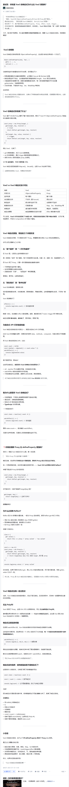

# H5、C3

## H5 新特性

1、H5 新增了一些语义化标签：nav、aside、footer、section 等  
2、新增表单的一些类型：color、email、month、week 等  
3、新增音频视频标签  
4、新增 Canvas 标签  
5、localStorage、sessionStorage 实现浏览器存储  
6、可以通过 dragable 进行元素拖放  
7、可以通过 getCurrentPosition 获取用户定位  
8、WebSocket 实现长链接通讯

## C3 新特性

- 新增伪类选择器：nth-child
- border-radius、background-size、text-shadow、box-shadow
- 动画：关键帧@keyframes
- 过度：transition
- 媒体查询：@media

## BFC

块级格式化上下文，它是页面上的一块渲染区域，有自己的一套渲染规则。它决定了子元素如何定位，以及其它元素的相互作用和关系。
翻译成白话就是：BFC 可以把它看做一个容器，不管容器内如何翻江倒海，都不会影响容器外部元素的布局。
触发条件：

- body 元素
- float 属性除了 none
- position 为 absolute、fixed
- display 为 inline-block、table-cells、flex
- overflow 除了 visible

特性和应用：

1、边距塌陷。可以放在不同的 BFC 容器中  
2、文字环绕效果。利用浮动元素的 BFC 特性  
3、容器内包裹浮动元素，元素不会占位。这时候触发容器 BFC 就会是元素占位

## 一像素问题

- 通过伪类和 scaleY(0.5)实现边框
- 通过 box-shadow 通过阴影实现：box-shadow: inset 0px -1px 1px -1px black;

## css 如何实现元素水平垂直居中

## CSS 怎么三角形、画任意多边形

## 弹性盒子，以及 box-sizing 的值

## flex 常用的属性，以及 flex 的三个组成

**容器属性**

- justify-content：定义了项目在主轴上的对齐方式
- align-item：项目在交叉轴上如何换行
- flex-direction：决定主轴方向
- flex-wrap：一条轴线拍不下该如何换行
- align-content：多根轴线的对齐方式

**项目属性**

- order：数值越小越靠前，默认 0
- flex：数值越小越靠前，默认 0

## flex grid 常见属性

## 左边固定右边自适应;calc() 函数

## rem 和 em 的区别

## Position(定位)属性

# 网络协议 & 浏览器

## 输入 URL 到页面的呈现

[查看详情](https://github.com/DDYMZL/blog/blob/main/%E5%AD%A6%E4%B9%A0/%E6%B5%8F%E8%A7%88%E5%99%A8%E6%98%AF%E6%80%8E%E4%B9%88%E6%B8%B2%E6%9F%93%E9%A1%B5%E9%9D%A2%E7%9A%84.md)

## 浏览器缓存

**强缓存：**  
给资源设置个过期时间，客户端每次请求资源时都会看是否过期；只有在过期才会去询问服务器。当浏览器去请求某个文件的时候，服务端就在 respone header 里面对该文件做了缓存配置。缓存的时间、缓存类型都由服务端控制，具体表现为：respone header 的 cache-control，常见的设置是 max-age public private no-cache no-store。

- max-age: xxx
  客户端在 xxx 秒的有效期内，如果有请求该资源的需求的话就直接读取缓存
- public
  表示可以被浏览器和代理服务器缓存，代理服务器一般可用 nginx 来做(点击浏览器左上角的刷新按钮去刷新页面，这时候就算资源没有过期，浏览器也会直接去请求服务器，这就是额外的请求消耗)
- immutable
  表示该资源永远不变，但是实际上该资源并不是永远不变，它这么设置的意思是为了让用户在刷新页面的时候不要去请求服务器！(就算用户刷新页面，浏览器也不会发起请求去服务)

**协商缓存：**
请求资源时，把用户本地该资源的 etag 同时带到服务端，服务端和最新资源做对比。  
如果资源没更改，返回 304，浏览器读取本地缓存。  
如果资源有更改，返回 200，返回最新的资源。

- etag：每个文件有一个，改动文件了就变了，就是个文件 hash，每个文件唯一，就像用 webpack 打包的时候，每个资源都会有这个东西
- last-modified：文件的修改时间，精确到秒

## Http 与 Http2 区别

## https，http 之间的区别

- http 明文传输，数据未经过加密，安全性差。https 数据经过加密，安全性好
- https 需要证书进行认证
- http 和 https 的端口不一致。http 用的是 80 端口，https 用的是 443 的端口
- http 比 https 响应速度快。http 使用的是 TCP 三次握手，传输 3 个包。而 https 除了这 3 个还有 SSL 的 9 个包，一共 12 个包。

## 常见的 http 状态码

2\*\*：成功，操作被成功接收并处理

- 200：成功
- 204：成功，但没数据返回

3\*\*：重定向，需要进一步的操作以完成请求

- 304：资源未作修改，资源被缓存

4\*\*：客户端错误，请求包含语法错误或无法完成请求

- 400：客户端请求的语法错误，服务器无法理解
- 403：服务器理解请求客户端的请求，但是拒绝执行此请求
- 404：服务器无法根据客户端的请求找到资源

5\*\*：服务器错误，服务器在处理请求的过程中发生了错误

- 500：服务器内部错误，无法完成请求

## 前端安全（XSS、CSRF）

XSS：跨站脚本攻击，会窃取用户的 cookie、通过脚本影响页面结构、跳转到别的页面等。

- 对用户输入的内容进行过滤
- 去除 script 标签等关键字
- 限制用户输入的长度

CSRF：跨站请求伪造。盗用用户登录状态、冒充用户完成操作或者修改数据

- 添加验证码，输入验证码才能请求
- 在请求头添加 token，在请求头放入攻击者不能伪造的信息且该信息不存在与 cookie 之中

## 前端跨域

同源策略中，协议、域名、端口三者有一个不一致就会引发跨域。
CORS 后端响应头 Access-Control-Allow-Origin 与前端请求头中的 Origin 设置一样的域名就可以进行请求

## cookie, session, token, localstorage, sessionstorage

cookie：大小 5k 左右，存储在客户端
session：存储在服务端
localstorage：大小 5M 左右
sessionstorage：大小 5M 左右

## cookies 使用场景

## LocalStorage 如何设置过期时间

在存的时候，多设置一个属性 time。取值的时候拿这个 time 和当前的时间做比对。超过了则视为过期

## TCP 连接(三次握手, 四次挥手)

## TCP，UDP

## 性能优化

- 图片优化的方式

1、精灵图
2、使用字体图标代替图片图标
3、使用 C3 动画效果代替图片动画效果
4、使用图片懒加载

- 长列表性能优化。使用 Object.freeze 进行冻结
- 第三方插件的按需引入。如 ECharts
- 服务器渲染或预渲染。
- 采用 GZip 压缩
- 浏览器缓存静态资源
- CDN 引入

## 500 张图片，如何实现预加载优化

使用 IntersectionObserver 实现图片懒加载

## 处理并发数解决

1、利用节流控制在一定时间内只对接口访问固定次数
2、一些静态资源通过 CDN 引入
3、后端设置强缓存。在固定时间内访问资源，读取缓存资源

# JS

## let, var, const 区别

- var 声明的变量会挂载在 window 上，而 let 和 const 声明的变量不会
- var 声明变量存在变量提升，let 和 const 不存在变量提升
- let 和 const 声明形成块作用域
- 同一作用域下 let 和 const 不能声明同名变量，而 var 可以
- 暂存死区

  a = 10; // Error:a is not defined  
  let a = 1

- const 一旦声明必须赋值,不能使用 null 占位、const 声明后不能再修改、const 如果声明的是复合类型数据，可以修改其属性

## ES6 新特性

- let 和 const
- 模板字面量

```js
`今年${age}岁了`;
```

- 解构赋值
- 对象字面量

```js
let a = 1;
// 属性名称和所分配的变量名称一样，那么就可以从对象属性中删掉这些重复的变量名称。
const obj = { a };
```

- for...of 循环
- 展开运算符
- 箭头函数
- class

## 解构赋值和 Object.assign 有什么区别

- 解构赋值
  只能对一维数组或对象进行深拷贝，不能对多维数组或对象进行深拷贝
- Object.assign(target, sources)
  如果改变 target 的属性值，则是浅拷贝；如果改变 sources 则是深拷贝。只会拷贝第 一层，深层次只会做浅拷贝

## document.all 页面的所有的元素的如何获取

## document.ready 和 window.onload 的区别

## 原生 ajax 请求

1. 创建 XMLHttpRequest 对象
   var xhr = new XMLHttpRequest();
2. 调用 open 方法，规定请求的类型、URL 以及是否异步处理请求
   xhr.open("POST","/try/ajax/demo_post2.php",true);
3. 添加请求头，请求的参数的格式【post 请求需要】
   xhr.setRequestHeader("Content-type","application/x-www-form-urlencoded");
4. 发送请求
   xhr.send("name=Henry&age=14");
5. 监听状态码

## 深、浅拷贝

- 浅拷贝
  重新在堆中创建内存，拷贝前后对象的基本数据类型互不影响，但拷贝前后对象的引用类型因共享同一块内存，会相互影响。比如：展开运算符、Object.assign()
- 深拷贝
  从堆内存中开辟一个新的区域存放新对象，对对象中的子对象进行递归拷贝,拷贝前后的两个对象互不影响。比如：JSON.parse(JSON.stringify())、递归
- 赋值和深浅拷贝有啥区别？
  当我们把一个对象赋值给一个新的变量时，赋的其实是该对象的在栈中的地址，而不是堆中的数据。也就是两个对象指向的是同一个存储空间，无论哪个对象发生改变，其实都是改变的存储空间的内容，因此，两个对象是联动的。

## 实现深拷贝的方法

- 递归遍历
- JSON.parse(JSON.stringify())
- Object.assign({}, ...)

## 数组常用方法有哪些

- push
  往数组后添加数组项。无返回值
- unshift
  将一个或多个元素添加到数组的开头，此方法会改变原数组，返回值：该数组的新长度
- pop
  数组中删除**最后**一个元素，此方法会改变原数组，当数组为空时返回 undefined。返回值：返回删除元素的值
- shift
  从数组中删除**第一个**元素，此方法会改变原数组，当数组为空时返回 undefined。返回值：返回删除元素的值
- splice(start, deleteCount, items)
  对数组进行增加、删除（如果 deleteCount 是 0 或者负数，则不删除）、替换，此方法会改变原数组。返回值：由被删除的元素组成的一个数组，如果没有删除元素，则返回空数组。
- forEach
  循环数组项。无返回值
- find
  返回数组中满足提供的测试函数的第一个元素的值
- map
  创建一个新数组，这个新数组由原数组中的每个元素都调用一次提供的函数后的返回值组成。
- some
  测试数组中是不是至少有 1 个元素通过了被提供的函数测试。它返回的是一个 Boolean 类型的值。
- every
  测试一个数组内的所有元素是否都能通过某个指定函数的测试。它返回一个布尔值
- filter
  创建一个新数组，其包含通过所提供函数实现的测试的所有元素
- reduce
  为数组每项执行该函数，将其结果汇总为单个返回值

[其它数组详情请点击](https://developer.mozilla.org/zh-CN/docs/Web/JavaScript/Reference/Global_Objects/Array)

## array.reduce 的应用场景，array.reduce 参数是哪两个

场景：

- reduce 可以进行数组扁平化
- 对数组项进行计算的

参数：

- 匿名函数
  为数组每项执行该函数，将其结果汇总为单个返回值
- initialValue
  作为第一次调用 callback 函数时的第一个参数的值  
  [reduce 详情](https://blog.csdn.net/weixin_33690963/article/details/91420041)
  [reduce 高阶](https://juejin.cn/post/6844904063729926152)

## 扁平化数组转换成树形结构，说说思路

## js 的数据类型有哪些，值是如何存储的

最新的 ECMAScript 标准定义了 8 种数据类型，简单数据类型存储在栈，复杂数据类型存储在堆  
7 种原始数据类型

- undefined
- Boolean
- Number
- String
- Bigint 可以用任意精度表示整数
- Symbol 符号类型是唯一的并且是不可修改的
- Null

复杂数据类型

- Object

## 原型链


## 闭包

上级作用域内变量的生命周期，因为被下级作用域内引用，而没有被释放。就导致上级作用域内的变量，等到下级作用域执行完以后才正常得到释放。  
闭包的作用就是延长变量的生命周期

## arguments 对象

arguments 中包含了函数传递的参数、length、和 callee 属性

- length
  属性表示的是实参的长度，即调用函数的时候传入的参数个数
- callee
  属性则指向的函数自身，我们可以通过它来调用自身函数。

## JS 创建对象的几种方式

[查看详情](http://alvinyuxt.github.io/2016/11/11/%E8%AF%BB%E4%B9%A6%E7%AC%94%E8%AE%B0%E4%B9%8B%E5%88%9B%E5%BB%BA%E5%AF%B9%E8%B1%A1/)

- 工厂模式
- 构造函数模式
- 原型模式
- 构造函数和原型组合模式
- 动态原型模式
- 寄生构造模式
- 稳妥构造模式

## 0.1+0.2===0.3?为什么

因为 0.1、0.2 这种小数在计算机是用二进制来储存的，用二进制来表示的话，无法整除，由于存储空间有限，最后计算机会舍弃后面的数值，所以我们最后就只能得到一个近似值。在 0.1 + 0.2 这个式子中，0.1 和 0.2 都是近似表示的，在他们相加的时候，两个近似值进行了计算，不够近似于 0.3，于是就出现了 0.1 + 0.2 != 0.3 这个现象。

## JavaScript 类型判断有哪些方式以及优缺点？

- typeof

1. 对于基本类型，除 null 以外，均可以返回正确的结果
2. 对于引用类型，除 function 以外，一律返回 object 类型。
3. 对于 null ，返回 object 类型。
4. 对于 function 返回 function 类型。

- instanceof
  instanceof 只能用来判断两个对象是否属于实例关系，而不能判断一个对象实例具体属于哪种类型。
- constructor

1. null 和 undefined 是无效的对象，因此是不会有 constructor 存在的，这两种类型的数据需要通过其他方式来判断。
2. 函数的 constructor 是不稳定的，这个主要体现在自定义对象上，当开发者重写 prototype 后，原有的 constructor 引用会丢失，constructor 会默认为 Object

- Object.prototype.toString.call()

## 什么是事件委托？事件传播？事件捕获？事件冒泡？

- 事件委托
  把一个元素的响应事件的函数委托到另一个元素
- 事件传播
  事件传播机制：当某个元素的相关事件行为触发时，浏览器会做三件事

1. 捕获阶段
   从最外层向最里层事件源依次进行查找，
2. 目标阶段
3. 冒泡阶段
   从内到外的顺序

- 阻止事件冒泡
  event 对象的 stopPropagation()函数
  

## 节流和防抖

- 防抖
  在第一次触发事件时，不立即执行函数，而是给出一个期限值比如 200ms，如果在 200ms 内没有再次触发滚动事件，那么就执行函数；如果在 200ms 内再次触发滚动事件，那么当前的计时取消，重新开始计时。  
  **效果：** 如果短时间内大量触发同一事件，只会执行一次函数
- 节流
  类似控制阀门一样定期开放的函数，也就是让函数执行一次后，在某个时间段内暂时失效，过了这段时间后再重新激活。  
  **效果：** 如果短时间内大量触发同一事件，那么在函数执行一次之后，该函数在指定的时间期限内不再工作，直至过了这段时间才重新生效。

## JS 延迟加载

- defer 属性
  script 标签定义了 defer 属性，等于告诉浏览器立即下载，但延迟执行
- async 属性
  script 标签定义了 async 属性，不让页面等待脚本下载和执行，从而异步加载页面其他内容。
- 动态创建 DOM 方式
- 使用 jQuery 的 getScript 方法
- 使用 setTimeout 延迟方法
- 让 JS 最后加载
  把 js 外部引入的文件放到页面底部，来让 js 最后引入，从而加快页面加载速度

## 作用域、作用域链、执行上下文、词法作用域

- 作用域
  作用域就是一个独立的地盘，让变量不会外泄、暴露出去。也就是说作用域最大的用处就是隔离变量，不同作用域下同名变量不会有冲突。
- 作用域链
  在当前作用域没有找到变量，从而往上一层一层寻找，这种一层一层的关系，就是作用域链。
- 作用域和执行上下文
  JavaScript 的执行分为：解释和执行两个阶段。**解释阶段** 词法分析、语法分析、作用域规则确定。**执行阶段** 创建执行上下文、执行函数代码、垃圾回收。  
  JavaScript 解释阶段便会确定作用域规则，因此作用域在函数定义时就已经确定了，而不是在函数调用时确定，但是执行上下文是函数执行之前创建的。执行上下文最明显的就是 this 的指向是执行时确定的。而作用域访问的变量是编写代码的结构确定的。**作用域和执行上下文之间最大的区别是：** 执行上下文在运行时确定，随时可能改变；作用域在定义时就确定，并且不会改变。
- 词法作用域
  词法作用域是定义表达式并能被访问的区间.换言之，一个声明（定义变量、函数等）的词法作用域就是它被定义时所在的作用域。

## call、apply 和 bind

- call
  使用一个指定的 this 值和单独给出的一个或多个参数来调用一个函数。
- apply
  调用一个具有给定 this 值的函数，以及以一个数组（或类数组对象）的形式提供的参数。
- bind
  创建一个新的函数，在 bind() 被调用时，这个新函数的 this 被指定为 bind() 的第一个参数，而其余参数将作为新函数的参数，供调用时使用。
- 不同点

1. call 和 bind 接收的参数不一样，返回的都是函数执行结果
2. bind 是返回的函数的拷贝，所以需要自行调用
3. call/apply 改变了函数的 this 上下文后马上执行该函数。
4. bind 则是返回改变了上下文后的函数,不执行该函数。

## new 做了哪些事情

1. 创建一个新对象
2. 将构造函数的作用域赋给新对象
3. 执行构造函数中的代码
4. 返回一个新对象

## async/await 是怎么实现的？优缺点

[详解](https://jishuin.proginn.com/p/763bfbd67a9b)

- 优点

1. 异步代码，同步执行
2. 代码清晰，便于维护

- 缺点

1. 无法处理 promise 返回的 reject 对象，要借助 try/catch
2. 只能做串行，不能并行

## 如何书写一个 generate 函数

## 继承的几种方式

1. 原型链继承
2. 借用构造函数继承
3. 原型式继承
4. 组合继承
5. 寄生组合式继承
6. ES6 类继承 extends
   [查看详情](https://zhuanlan.zhihu.com/p/37735247)

## AMD 和 CMD 的区别

[查看详情](https://juejin.cn/post/6844903837824712718)

## ES6 模块与 CommonJS 模块

- **commonJS 输出的是值的拷贝，而 ES6 模块是输出的对值的引用。**
  commonJS 一旦引入某个模块，模块内部的改变，不会再影响到这个值。它不论加载多少次，只会在第一次加载时，运行一次，之后都是返回的第一次的缓存。除非手动清除缓存；ES6 通过 import 动态引入模块，换句话说就是它不会缓存值，模块里面的值变了，import 加载的值也会跟着变化。
- **commonJS 是运行时全部加载模块，ES6 是编译的时候，只加载使用的模块。**
  commonJS 在加载时，先加载一整个对象，然后再从对象上读取方法，这种加载叫运行时加载；ES6 则是编译时加载或者静态加载，就是在 import 的时候，指定加载某个值，而不是加载一整个模块。
  [查看详情](https://juejin.cn/post/6844903837824712718)

## 微任务、宏任务、EventLoop 详细说明

JS 代码从上至下执行，执行到微任务和宏任务的时候，会把微任务宏任务放到任务队列中。微任务放到微任务队列，宏任务放到宏任务队里。当同步代码执行完，会判断任务队列中有无任务执行，如果存在任务，则先执行微任务，再执行宏任务。以此循环则构成事件循环。

## 重绘、重排

**重绘：**  
元素的外观发生了改变，但没有改到布局，重新把外观绘制出来的过程叫做重绘。比如：color、background-color、visibility
**重排：**  
重新生成布局，从新排列元素。DOM 元素被改变了几何信息，浏览器需要重新计算几何信息，将元素重新放置到界面中正确位置，这个过程叫做重排。比如：width、height、margin、padding 等

## 暂时性死区

## Axios

## Promise 的 then 的第二个参数和 catch 的区别

catch 不仅能获取到 promise 中的错误，同时也能获取到 then 第一个函数中的错误，而第二个函数拦截到的错误信息，只能是 promise 本身的错误。[查看详情](https://yixirumeng.github.io/2018/08/18/promise-then-second-param-md/)

## promise 中 all、race、any

1. Promise.all()中的 Promise 序列会全部执行通过才认为是成功，否则认为是失败；
2. Promise.race()中的 Promise 序列中第一个执行完毕的是通过，则认为成功，返回的是成功的值，如果第一个执行完毕的 Promise 是拒绝，则认为失败，返回的是失败的返回值(比如 reject(1),那这里就是返回 1)；
3. Promise.any()中的 Promise 序列只要有一个执行通过，则认为成功，返回的是成功的值，如果全部拒绝，则认为失败；

## promise 原理

## 如何设计多个 promise 组合执行

## webpack 优化，如何去做性能优化

## webpack5 的了解，有用过那些 webpack5 的插件

webpack5 相比之前，它内置了一些 loader，用起来更加方便

## webpack 的 loader 和 plugin 有什么作用

**loader**  
它是文件加载器，能够加载资源文件，并对其做一些处理，最终打包到指定文件中。就像一个翻译官，每个 loader 可以把资源转化然后传递给下一个 loader。但最后一个 loader 必须返回 js，因为浏览器只能运行 js 代码。
**plugin**  
可以为 webpack 提供各种功能，如打包优化，资源管理等，解决一些 loader 无法解决的事情

## webpack 摇树原理

## vite 和 webpack 区别

## webpack 如何配置大型项目

## NodeJS 有没有用过，做了什么，大概说下怎么做的

## import 和 require 区别

## 简述说下观察者模式

# Vue

## Vue2、Vue3 双向绑定的实现

- v2 和 v3 的响应式原理是不一样的。v2 中的响应式是通过对象的 defineProperty 对已有的属性值进行数据劫持（监视和拦截）v3 则是通过 proxy 和 reflect 对数据进行拦截和处理
- v2 中是通过：Object.defineProperty()对数据进行劫持，当读取数据的时候会触发 getter，当数据改变时候会触发 setter，监听到数据变化之后，会由订阅器 Dep 通知订阅者 watcher 通知视图更新；反之，当视图发生变化，compile 会解析模板指令，将模板中的变量转为数据，然后绑定更新函数 update()，添加订阅者，完成数据更新。
- v3 是通过 proxy 代理对数据进行拦截，然后再通过 reflect 对相应的属性进行动态操作。

## vue 响应式原理与 v-model 实现

## v-model 如何自定义

## proxy

## v-for 中为啥不推荐 index 作为 key

- key 的作用主要就是为了高效的更新虚拟 DOM，使用 key 值，它会基于 key 的变化重新排列元素顺序，并且会移除 key 不存在的元素。它也可以用于强制替换元素/组件而不是重复的使用它。
- 当以数组为下标的 index 作为 key 值时，其中一个元素(例如增删改查)发生了变化就有可能导致所有的元素的 key 值发生改变 diff 算法时比较同级之间的不同，以 key 来进行关联，当对数组进行下标的变换时，比如删除第一条数据，那么以后所有的 index 都会发生改变，那么 key 自然也跟着全部发生改变，所以 index 作为 key 值是不稳定的，而这种不稳定性有可能导致性能的浪费，导致 diff 无法关联起上一次一样的数据。因此，能不使用 index 作为 key 就不使用 index。

## Vite 新特性

- 利用原生的 ESM，不用自己实现一套兼容各种模块标准的模块化方案，开发服务器启动后用到什么资源请求什么资源，天然的按需加载。
- 利用 esbuild 把耗时的构建过程变成更轻量的依赖预构建，构建速度几十上百倍的提升。
- 预构建依赖时会缓存文件，浏览器请求过的依赖也会设置强缓存，其它资源开发服务器也会根据是否变动协商缓存。

## Vue3 新特性

- Composition API
  将零散分布的逻辑组合在一起来维护，并且还可以将单独的功能逻辑拆分成单独的文件
- setup
- reactive、ref 与 toRefs
- 生命周期
- watch 与 watchEffect 的用法
- 响应式差别
- Teleport 任意门
- Suspense
- Fragment 片段

## Vue3 和 vue2 的响应式区别



## vue3 订阅发布模式

## vue 动态组件切换不同组件是否会组件销毁

会被销毁。可以使用 keep-alive 进行缓存

## vue 的生命周期勾子以及做了哪些事

## 父子组件，兄弟组件之间的通讯方式有哪些

## Vue 的 diff 算法

当组件创建和更新时，vue 会执行内部的 update 函数，该函数使用 render 函数生成的虚拟 dom 树，将新旧两树进行对比，找到差异点，最终更新到真实 dom。在对比时，vue 采用深度优先（DFS）、同级比较的方式进行比对。同级比较就是说它不会跨越结构进行比较，在判断两个节点是否相同时，vue 是通过虚拟节点的 key 和 tag 来进行判断的，对比差异的过程叫 diff

## computed 原理

## methods、computed 和 watch 有什么区别


## 路由的原理

路由分为两种：hash 和 history。

- hash 主要是通过 hashChange 监听地址栏 hash 值的变化，从而触发对应的函数，更新页面
- history 主要是通过 pushState 和 replaceState 在不刷新页面的情况下，操作浏览器的离职记录，然后通过 popState 来监听 url 的变化，从而触发相应函数，改变页面

## hash 和 history 的区别

|          | hash             | history                  |
| -------- | ---------------- | ------------------------ |
| 外观     | 有#号            | 正常 URL，无#            |
| 刷新页面 | 能进入对应的页面 | 如果没有服务器支持会 404 |
| 版本支持 | 支持低版本       | H5 新 API                |

## vuex

五个核心模块：

- state
  状态储存，改变 Vuex 中的状态的唯一途径就是显式地提交 mutation
- getters
  可以认为是 store 的计算属性，派生出一些状态
- mutations
  更改 Vuex 的 store 中的状态的唯一方法是提交 mutation
- actions
  Action 提交的是 mutation，而不是直接变更状态  
  Action 可以包含任意异步操作。
- modules
  将 store 分割成模块

## vuex 中 state 的两种方式以及区别

## nextTick 原理

- 源码层面：
  nextTick 是在 DOM 更新之后立马完成回调，当数据发生改变的时候，watcher 执行 update 方法，将 watcher 放入 watcher 队列，通后通过 nextTick 方法将一个刷新 watcher 队列的方法（flushSchedulerQueue）放入一个全局的 callbacks 数组中。flushCallbacks 函数负责执行 callbacks 数组中的所有 flushSchedulerQueue 函数。flushSchedulerQueue 函数按照队列中的 watcher.id 从小到大排序，负责刷新 watcher 队列，即执行 queue 数组中每一个 watcher 的 run 方法，从而进入更新阶段。  
  而 nextTick 将传递的回调函数用 try catch 包裹然后放入 callbacks 数组。执行 timerFunc 函数，在这里进行了降级策略的判断（promise - MutationObserver - setImmediate - setTimeout ），在浏览器的异步任务队列放入一个刷新 callbacks 数组的函数.

- 口语化
  由于 js 是单线程工作的，在 js 中，一些操作行为比如点击，渲染，请求等，都会由事件循环来协调处理。事件循环会维护一个或者多个任务队列，每执行完一个就从队列中移除，这就是一次事件循环。在事件循环中存在微任务和宏任务，由于微任务的优先级总是大于宏任务的机制，当我们在调用 nextTick 的时候，就在 DOM 那个微任务后追加我们的回调函数。队列控制的最佳选择是微任务，而微任务的最佳选择则是 promise，由于 promise 是 es6 新增的，有些可能不支持，所以这里存在降级策略。如果当前环境不支持 promise、MutationObserver，就会降级到宏任务来处理，宏任务降级方案依次是：setImmediate、setTimeout。
  [查看详情](https://juejin.cn/post/6951568091893465102)

# 其它

## 虚拟列表

## 微前端如何落地，如何执行，产生什么效益

## 做过最大的项目

## 设计模式

## QianKun 内部的实现原理

## ssr 和单页面应用区别

## git 工作流
